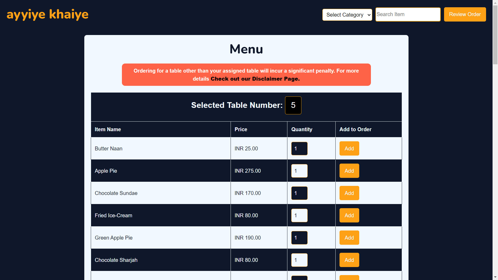
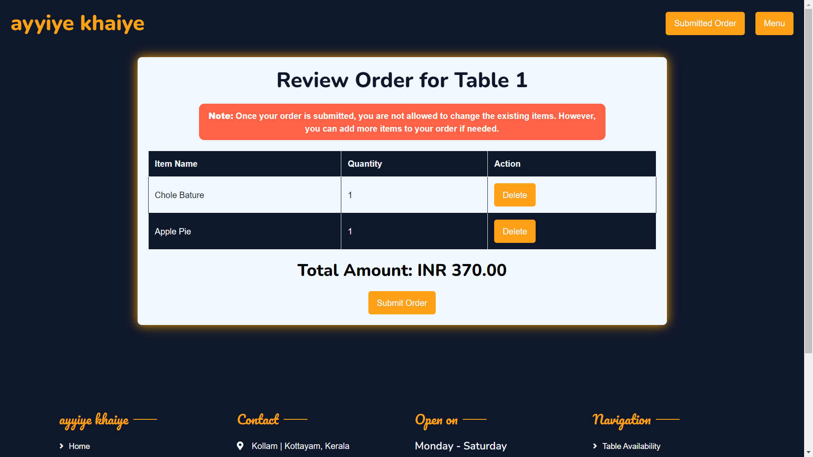
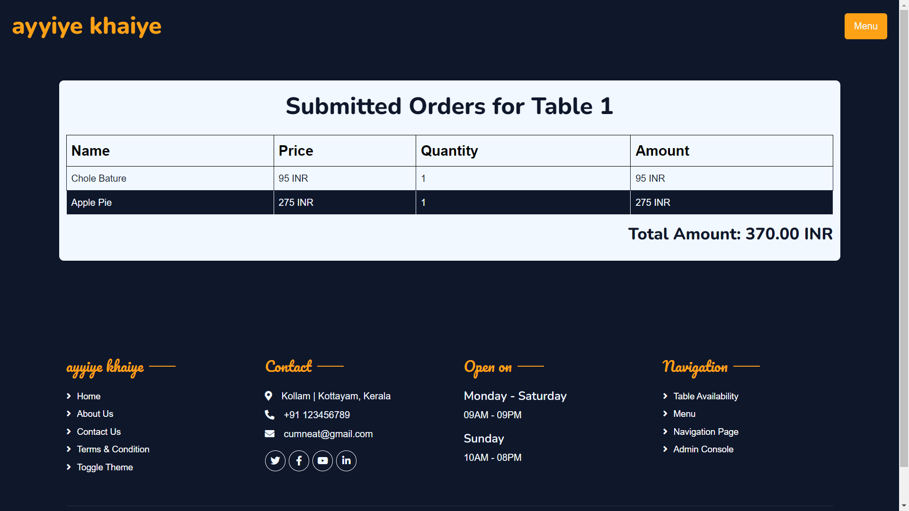
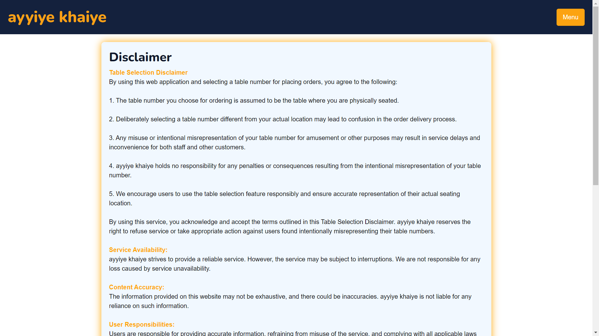
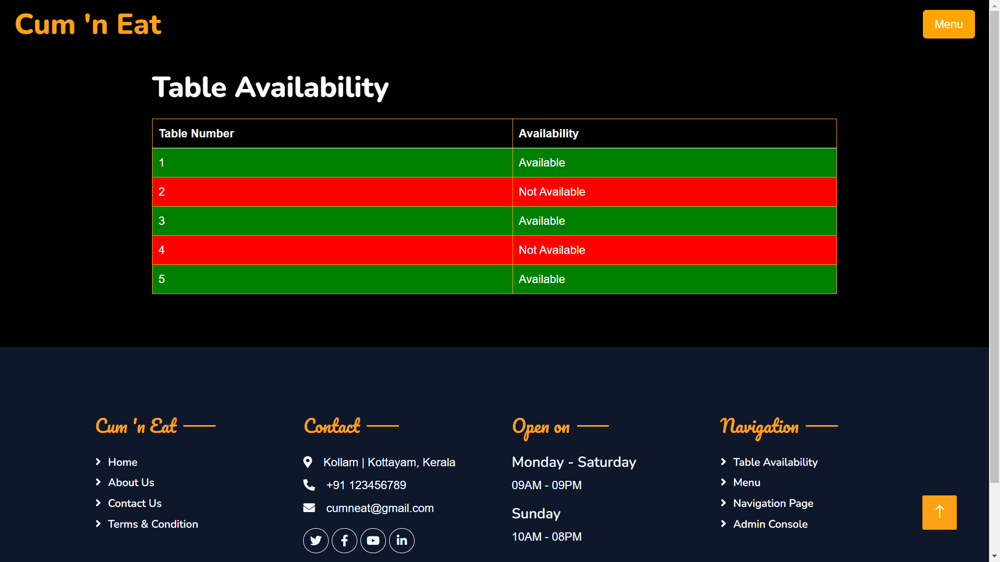
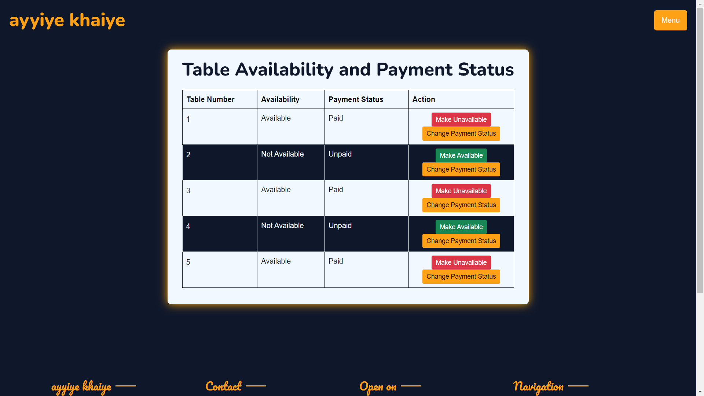

<div align="center">
   
   [](https://5pgxcl-3000.csb.app/)
   
</div>

---

<div align="center">
   
## **Abstract:**

ayyiye khaiye menu application is a web-based platform designed to streamline the ordering process for customers and facilitate efficient management for staff. The application provides an intuitive user interface, allowing customers to browse through an extensive menu categorized into soups, starters, main courses, snacks, desserts, and drinks.

</div>

---

## Waiterless Dine-in Experience:

ayyiye khaiye aims to provide a seamless and waiterless dine-in experience for customers. By leveraging the application's features, customers can:
   - **Self-Order:** Browse the menu, place orders, and customize preferences without assistance.
   - **Real-Time Updates:** Receive real-time updates on order status, eliminating the need for constant waiter interaction.
   - **Order Customization:** Easily modify orders, add special instructions, and personalize their dining experience.
   - **Efficient Service:** Enjoy quicker service with instant order submissions and reduced wait times.

---

## Key Features:

1. **Dynamic Menu Filtering:**
   - Users can filter the menu items based on categories, such as soups, starters, etc.
   - The application dynamically fetches and updates menu data from the server based on the selected category.

2. **Order Management:**
   - Customers can easily add items to their orders, specifying quantities for each menu item.
   - The application calculates the total amount for each item and maintains a real-time order list.

3. **Order Review:**
   - Customers can review their order before submission, providing a summary of selected items and quantities.

4. **Persistence:**
   - Order data is temporarily stored locally, ensuring a seamless user experience during the ordering process.

5. **Scalability:**
   - The application is designed to scale with additional features, such as real-time updates, and integration with a backend database for persistent storage of menu items and orders.

6. **Interactive User Interface:**
   - An interactive and visually appealing UI enhances user engagement, making the ordering process enjoyable and straightforward.

7. **Mobile Responsiveness:**
   - The application is optimized for various devices, providing a consistent and user-friendly experience across desktops, tablets, and smartphones.

---

<div align="center">

## Contributing
We welcome contributions! If you have suggestions, bug reports, or would like to add new features, feel free to open an issue or submit a pull request.

---

## License
This project is licensed under the MIT License.

---

## Screen Shots









---

## Routes
For Routes, check out
```
/navigation
```

---

## Installation
```
npm install express mongoose body-parser dotenv ejs multer express-session
```

</div>

---

## Directory Structure
```
/Restaurant App
├── middleware/
│   └── middleware.js
├── models/
│   └── KitchenView.js
│   └── MenuItem.js
│   └── Order.js
│   └── SubmittedOrder.js
│   └── Table.js
│   └── User.js
├── public/
│   └── css/
│   └── images/
│   └── js/
│   └── lib/
│   └── scss/
├── routes/
│   └── additemRoutes.js
│   └── adminRoutes.js
│   └── adminsuborderscheckRoutes.js
│   └── adminsubordersRoutes.js
│   └── kitchenRoutes.js
│   └── menuRoutes.js
│   └── submittedOrdercheckRoutes.js
│   └── submittedOrderRoutes.js
│   └── tableavailRoutes.js
│   └── tableRoutes.js
│   └── toorderRoutes.js
├── views/
│   └── additem.ejs
│   └── admin.ejs
│   └── adminsuborders.ejs
│   └── adminsuborderscheck.ejs
│   └── contact.ejs
│   └── disclaimer.ejs
│   └── index.ejs
│   └── kitchenview.ejs
│   └── menu.ejs
│   └── navigation.ejs
│   └── revieworder.ejs
│   └── submittedOrdercheck.ejs
│   └── submittedOrders.ejs
│   └── tableavail.ejs
│   └── tables.ejs
├── .env
├── Directory Structure.txt
└── app.js
```
